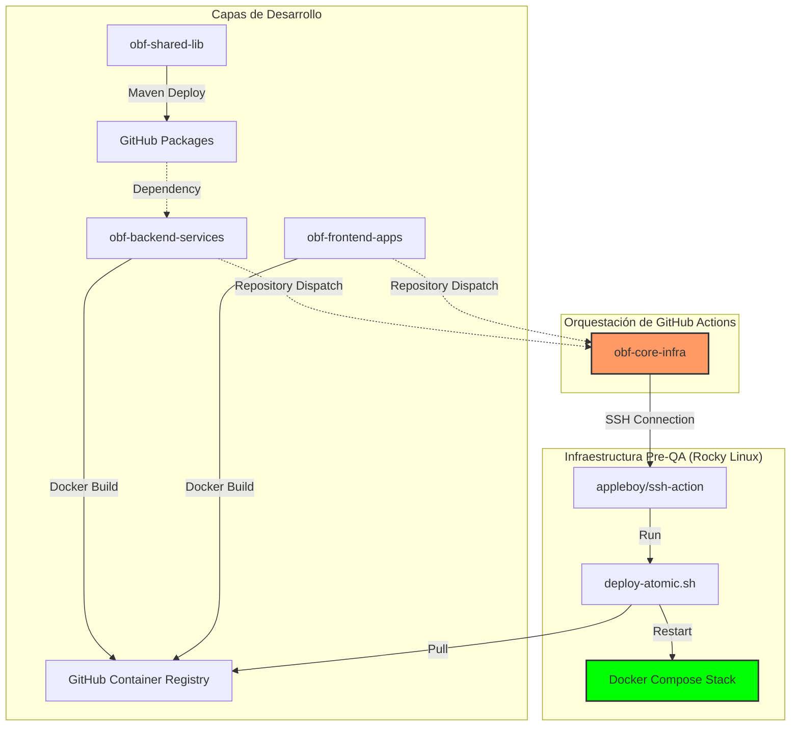

# 🛠️ Manual Técnico: Sistema de CI/CD OBFSSB (Pre-QA)

Este documento detalla la arquitectura, el flujo de trabajo y los procedimientos operativos del mecanismo de Integración y Despliegue Continuo (CI/CD) diseñado para el ecosistema **OBFSSB** (Digital Onboarding & Banking Framework).

---

## 1. Visión General de la Arquitectura

El sistema de CI/CD de OBFSSB está diseñado bajo una arquitectura de **Orquestación Desacoplada**. Los repositorios de código (Backend/Frontend) se encargan de la "Integración" (Build & Push), mientras que el repositorio de infraestructura centraliza el "Despliegue" (Remote Execution).

### Componentes del Ecosistema:
*   **obf-shared-lib:** Librerías base compartidas (Seguridad, Modelos, Utils).
*   **obf-backend-services:** Monorepo de microservicios Java 21 / Spring Boot 3.4+.
*   **obf-frontend-apps:** Aplicaciones Angular 20 (Client Onboarding & Backoffice Admin).
*   **obf-core-infra:** Definiciones de Docker Compose, configuraciones de red, seguridad y monitoreo.
*   **Doc_Onboarding:** Documentación técnica, manuales y arquitectura.

---

## 2. Diagrama de Flujo del CI/CD

El siguiente diagrama ilustra el flujo desde que un desarrollador realiza un `push` hasta que el cambio está operativo en el servidor de Pre-QA.



---

## 3. Detalle de los Pipeline (Workflows)

### 3.1. Publicación de Librerías (`publish-lib.yml`)
*   **Trigger:** Push a `main` o `develop`.
*   **Acción:** Compila el proyecto con Maven y despliega el `.jar` en GitHub Packages.
*   **Importante:** Proporciona la base de dependencias para los microservicios, asegurando consistencia en modelos de datos.

### 3.2. Pipeline de Microservicios (`backend-pipeline.yml`)
*   **Estrategia:** Matriz de construcción paralela para los servicios `bff-onboarding`, `ms-document`, `ms-identity`, `ms-account`, `ms-risk`, `ms-admin`.
*   **Proceso:** Construcción de imagen Docker -> Push a GHCR -> Notificación a Infra.

### 3.3. Pipeline de Aplicaciones Web (`frontend-pipeline.yml`)
*   **Tecnología:** Node 20 + Angular CLI.
*   **Proceso:** `npm run build --configuration=production` -> Empaquetado en NGINX -> Push a GHCR -> Notificación a Infra.

### 3.4. Orquestador de Despliegue (`infra-deploy.yml`)
*   **Trigger:** Evento `repository_dispatch` (deploy-preqa).
*   **Método:** Conexión SSH segura hacia el host de Pre-QA.
*   **Script Atómico:** Ejecuta `./scripts/deploy-atomic.sh`, el cual realiza:
    1.  Login en GHCR.
    2.  `docker compose pull`.
    3.  `docker compose up -d` (Reemplazo no disruptivo).
    4.  Limpieza de imágenes antiguas (`prune`).

---

## 4. Configuración del Entorno (Secrets)

Para la ejecución exitosa de los pipelines, se requieren los siguientes secretos configurados en GitHub (Organization level preferido):

| Secret | Descripción | Ámbito |
| :--- | :--- | :--- |
| **GHCR_PAT** | Personal Access Token con permisos `repo` y `write:packages`. | Todos los repos. |
| **SSH_HOST** | Dirección IP o Hostname del servidor Pre-QA (ej. 172.16.32.106). | obf-core-infra |
| **SSH_USER** | Usuario con permisos de Docker en el servidor (ej. root/ci-user). | obf-core-infra |
| **SSH_PRIVATE_KEY** | Clave privada SSH para el login automático. | obf-core-infra |

---

## 5. Matriz de Contenedores SIF-PREQA

El stack final desplegado se compone de los siguientes servicios auditados:

| Categoría | Contenedores |
| :--- | :--- |
| **Core Services** | `sif-bff-onboarding`, `sif-ms-identity`, `sif-ms-onboarding` |
| **Support MS** | `sif-ms-document`, `sif-ms-account`, `sif-ms-risk`, `sif-ms-admin` |
| **Data & Messaging** | `sif-db-master` (Postgres), `sif-kafka-master`, `sif-cache` (Redis) |
| **Frontend** | `sif-onboarding-web`, `sif-backoffice-web` |
| **Edge & Sec** | `sif-gateway-v1` (NGINX), `sif-iam-master` (Keycloak) |

---

## 6. Procedimientos Administrativos

### Verificación de Salud
Después de cada despliegue automático, el desarrollador puede verificar el estado mediante:
1.  **GitHub Actions Tab:** Ver el check verde en el workflow de Infra.
2.  **Health Check Script:** Ejecutar `./check-health.sh` desde la terminal del servidor para ver el estado de los 15 servicios.

### Rollback (Reversión)
Si una nueva versión es inestable, se puede realizar un rollback manual ejecutando el workflow de `obf-core-infra` seleccionando manualmente el tag/imagen de la versión anterior estable.

---

## 7. Análisis de Costos y Límites de Operación (Privado)

El uso de GitHub Actions y GitHub Packages en repositorios privados bajo la estructura OBFSSB se rige por los siguientes límites (Valores base 2026):

| Concepto | Plan Free | Plan Team | Nota OBFSSB |
| :--- | :--- | :--- | :--- |
| **Cómputo (Ubuntu)** | 2,000 min/mes | 3,000 min/mes | Se agota rápido con builds de 16+ servicios. |
| **Almacenamiento** | 500 MB | 2 GB | Afecta a `.jar` en Packages y artefactos. |
| **GHCR (Docker)** | Gratis* | Gratis* | El ancho de banda hacia Actions es libre. |
| **Egress (Data)** | 1 GB | 10 GB | Tráfico hacia fuera de GitHub (ej. pre-qa). |

### Estrategias de Ahorro:
1.  **Cache Activo:** Uso de `actions/cache` para dependencias de Maven y Node para reducir tiempo de ejecución.
2.  **Runners en Premise:** Si se exceden los minutos, se recomienda instalar un **Self-hosted Runner** en la infraestructura de Scandinavian, aunque aplica el cargo de plataforma de $0.002/min.
3.  **Limpieza de Imágenes:** Script de purga automática en GHCR para mantener solo las últimas 5 versiones de cada microservicio.

---

## 8. Implementación de Woodpecker CI (Costo Cero)

Para desplegar Woodpecker CI en el servidor Rocky Linux (172.16.32.106) y eliminar los costos de GitHub Actions, siga estos pasos:

### 1. Preparar Infraestructura
Transfiera la carpeta `scripts/woodpecker` al servidor y ejecute el script de inicialización:
```bash
chmod +x setup-woodpecker.sh
./setup-woodpecker.sh
```

### 2. Configurar GitHub OAuth
1. En GitHub, cree una **OAuth App** con Callback URL: `http://172.16.32.106:8000/authorize`.
2. Edite el archivo `.env` en el servidor con el `WOODPECKER_GITHUB_CLIENT` y `WOODPECKER_GITHUB_SECRET`.
3. Reinicie los contenedores: `docker compose up -d`.

### 3. Configuración de Secretos en Woodpecker
Acceda a `http://172.16.32.106:8000`, active sus repositorios y configure los siguientes secretos en el panel de Woodpecker:
| Secreto | Descripción |
| :--- | :--- |
| **GHCR_USER** | Su usuario de GitHub. |
| **GHCR_PAT** | Token con permisos `write:packages`. |
| **SSH_USER** | Usuario para despliegue remoto. |
| **SSH_PRIVATE_KEY** | Clave privada para conexión SSH. |

---
> **Documento generado para el proyecto OBFSSB.**  
> **Versión:** 1.2.0  
> **Fecha:** 2026-04-10
