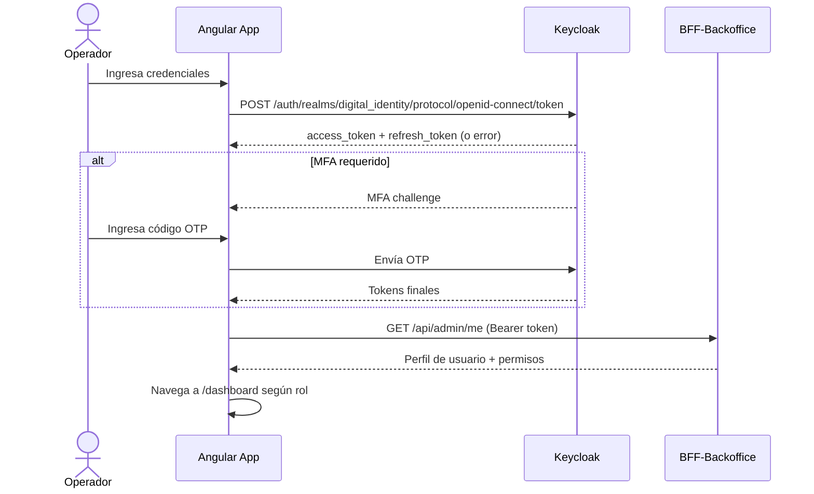
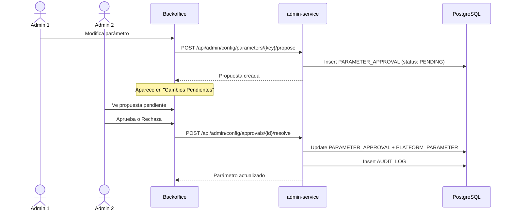

# Análisis Técnico de Pantallas — Backoffice Onboarding Digital SSB

> **Versión:** 2.0 · Marzo 2026  
> **Stack:** Angular 10 LTS · Spring Boot 4.x (Java 21 (Oracle)) · Keycloak · PostgreSQL 18  
> **Clasificación:** Confidencial – Uso interno

---

## Índice de Pantallas

| # | Pantalla | Módulo | Ruta Angular |
|---|---|---|---|
| 1 | Login | Auth | `/login` |
| 2 | Dashboard Ejecutivo | Home | `/dashboard` |
| 3 | Listado de Procesos | Tracker | `/tracker` |
| 4 | Detalle de Proceso | Tracker | `/tracker/:processId` |
| 5 | Health Monitor | Servicios | `/health` |
| 6 | Analítica y Reportes | Analytics | `/analytics` |
| 7 | Centro de Configuración | Config | `/config` |
| 8 | Gestión de Usuarios | RBAC | `/users` |
| 9 | Logs de Auditoría | Audit | `/audit` |
| 10 | Centro de Notificaciones | Alerts | `/notifications` |

---

## 1. Pantalla de Login

**Ruta:** `/login`  
**Roles:** Todos (público hasta autenticar)

### Descripción
Pantalla de autenticación OAuth2 vía Keycloak. Soporta MFA obligatorio para roles privilegiados (Administrador, Oficial de Cumplimiento).

### Elementos de UI

| Elemento | Tipo | ID | Validación |
|---|---|---|---|
| Logo SSB | Imagen | `login-logo` | — |
| Campo usuario | Input text | `login-username` | Required, min 4 chars |
| Campo contraseña | Input password | `login-password` | Required, min 8 chars |
| Botón "Iniciar Sesión" | Button primary | `login-submit` | Disabled until valid |
| Link "Olvidé mi contraseña" | Link | `login-forgot` | Redirige a Keycloak reset |
| Campo MFA (condicional) | Input OTP | `login-mfa-code` | 6 dígitos numéricos |
| Alerta de error | Alert banner | `login-error-alert` | Oculto por defecto |

### Flujo de Autenticación



### Reglas de negocio
- Bloqueo tras **5 intentos fallidos** (15 min).
- Registro en audit log: usuario, IP, timestamp, resultado.
- Sesión expira a los 30 min de inactividad.

### API Endpoints

| Método | Endpoint | Descripción |
|---|---|---|
| POST | `/auth/realms/digital_identity/.../token` | Autenticación OAuth2 |
| GET | `/api/admin/me` | Perfil y permisos del usuario autenticado |

---

## 2. Dashboard Ejecutivo

**Ruta:** `/dashboard`  
**Roles:** Administrador, Gerente de Operaciones, Oficial de Cumplimiento

### Layout

```
┌────────────────────────────────────────────────────────────────┐
│  Header: Logo SSB · Breadcrumb · Usuario · Notificaciones 🔔  │
├──────────┬─────────────────────────────────────────────────────┤
│          │  ┌──────────┐ ┌──────────┐ ┌──────────┐ ┌────────┐ │
│  Sidebar │  │ Activos  │ │ Comple-  │ │ Recha-   │ │ Tasa   │ │
│  - Dash  │  │  en vivo │ │ tados    │ │ zados    │ │ Conv.  │ │
│  - Track │  │   47     │ │  1,234   │ │   89     │ │  93.2% │ │
│  - Healt │  └──────────┘ └──────────┘ └──────────┘ └────────┘ │
│  - Analy │  ┌──────────────────────┐ ┌────────────────────────┐│
│  - Confi │  │  Embudo de Conversión│ │  Alertas Críticas      ││
│  - Users │  │  (gráfico de barras) │ │  ⚠ SEGIP: Latencia alta││
│  - Audit │  │  Paso 1: 100%        │ │  ✅ Core: Operativo     ││
│  - Notif │  │  Paso 2:  97%        │ │  ⚠ OCR: Degradado      ││
│          │  │  Paso 3:  94%        │ │                        ││
│          │  │  ...                 │ │                        ││
│          │  └──────────────────────┘ └────────────────────────┘│
│          │  ┌──────────────────────┐ ┌────────────────────────┐│
│          │  │ Tiempo Medio x Paso  │ │ Últimas Cuentas Abier. ││
│          │  │  (line chart)        │ │  • Juan P. - 14:32     ││
│          │  │                      │ │  • María L. - 14:28    ││
│          │  └──────────────────────┘ └────────────────────────┘│
└──────────┴─────────────────────────────────────────────────────┘
```

### Componentes (Widgets)

| Widget | ID | Tipo Visual | Datos (SSE) | Actualización |
|---|---|---|---|---|
| Onboardings Activos | `dash-active-count` | KPI Card | Contador en vivo | Tiempo real |
| Completados Hoy | `dash-completed-today` | KPI Card | Acumulado diario | 1 min |
| Rechazados Hoy | `dash-rejected-today` | KPI Card | Acumulado diario | 1 min |
| Tasa de Conversión | `dash-conversion-rate` | KPI Card + % | Iniciados vs completados | 5 min |
| Embudo de Conversión | `dash-funnel-chart` | Gráfico de barras horizontal | % por paso (1→8) | 5 min |
| Alertas Críticas | `dash-critical-alerts` | Lista con badges de estado | Estado servicios | Tiempo real |
| Tiempo Medio por Paso | `dash-avg-time-chart` | Line chart (últimas 24h) | Promedios por hora | 5 min |
| Últimas Cuentas | `dash-recent-accounts` | Feed scrollable | Últimas 10 aperturas | Tiempo real |

### Filtros Globales

| Filtro | ID | Tipo | Opciones |
|---|---|---|---|
| Rango de Fecha | `dash-date-range` | Date picker dual | Hoy, 7d, 30d, Custom |
| Canal | `dash-channel-filter` | Select | Todos, Web, Redes Sociales, Banca Digital |
| Producto | `dash-product-filter` | Select | Todos, Fortaleza Ágil, Fortaleza Crece |

### API Endpoints

| Método | Endpoint | Descripción |
|---|---|---|
| GET | `/api/admin/dashboard/kpis` | KPIs agregados |
| GET | `/api/admin/dashboard/funnel` | Datos del embudo por paso |
| GET | `/api/admin/dashboard/avg-time` | Tiempo promedio por paso |
| GET | `/api/admin/dashboard/recent-accounts` | Feed de últimas cuentas |
| SSE | `/api/admin/metrics/stream` | Stream tiempo real de métricas |

---

## 3. Listado de Procesos (Onboarding Tracker)

**Ruta:** `/tracker`  
**Roles:** Administrador, Soporte de Primer Nivel, Oficial de Cumplimiento, Gerente de Operaciones

### Layout

```
┌──────────────────────────────────────────────────────────────┐
│  Onboarding Tracker                              [Exportar ▼]│
├──────────────────────────────────────────────────────────────┤
│  🔍 Búsqueda rápida: [CI / Nombre / Email___________] [🔎]  │
│  Filtros: [Estado ▼] [Canal ▼] [Producto ▼] [Fecha ▼] [+]   │
├──────────────────────────────────────────────────────────────┤
│  Tabs: | Todos (1412) | En Curso (47) | Completados (1234)  │
│         | Rechazados (89) | Pendientes Revisión (12) |       │
├──────────────────────────────────────────────────────────────┤
│  ┌──┬─────────┬──────────┬──────────┬──────┬──────┬────────┐ │
│  │☐ │ CI      │ Nombre   │ Estado   │Canal │Paso  │Acciones│ │
│  ├──┼─────────┼──────────┼──────────┼──────┼──────┼────────┤ │
│  │☐ │1234567  │Juan Pérez│●Completo │ Web  │ 8/8  │ 👁 ⟳  │ │
│  │☐ │2345678  │María L.  │●En paso 4│ App  │ 4/8  │ 👁 ⟳  │ │
│  │☐ │3456789  │Carlos R. │●Rechazado│ RRSS │ 5/8  │ 👁    │ │
│  │☐ │4567890  │Ana S.    │⚠Revisión │ Web  │ 4/8  │ 👁 ✓  │ │
│  └──┴─────────┴──────────┴──────────┴──────┴──────┴────────┘ │
│  Paginación: ◀ 1 2 3 ... 47 ▶   Mostrando 1-25 de 1,412    │
└──────────────────────────────────────────────────────────────┘
```

### Columnas de la Tabla

| Columna | ID | Tipo | Ordenable | Descripción |
|---|---|---|---|---|
| Selección | `trk-checkbox` | Checkbox | No | Selección múltiple para acciones batch |
| CI | `trk-col-ci` | Text | Sí | Número de Carnet de Identidad |
| Nombre | `trk-col-name` | Text | Sí | Nombres y apellidos |
| Estado | `trk-col-status` | Badge con color | Sí | Estado actual del proceso |
| Canal | `trk-col-channel` | Badge | Sí | Web / RRSS / Banca Digital |
| Producto | `trk-col-product` | Text | Sí | Ágil / Crece |
| Paso Actual | `trk-col-step` | Progress (N/8) | Sí | Paso en el que se encuentra |
| Fecha Inicio | `trk-col-date-start` | DateTime | Sí | Inicio del proceso |
| Duración | `trk-col-duration` | Duration | Sí | Tiempo transcurrido |
| Acciones | `trk-col-actions` | Botones | No | Ver detalle, reintentar, aprobar |

### Estados del Proceso

| Estado | Badge Color | Descripción |
|---|---|---|
| `IN_PROGRESS` | 🔵 Azul | Proceso en curso |
| `COMPLETED` | 🟢 Verde | Cuenta creada exitosamente |
| `REJECTED_RISK` | 🔴 Rojo | Rechazado por listas de riesgo |
| `REJECTED_IDENTITY` | 🔴 Rojo | Verificación de identidad fallida |
| `PENDING_REVIEW` | 🟡 Amarillo | Requiere revisión manual |
| `EXPIRED` | ⚫ Gris | Proceso expirado por timeout |
| `CANCELLED` | ⚫ Gris | Cancelado manualmente |

### Filtros Avanzados

| Filtro | ID | Tipo | Opciones |
|---|---|---|---|
| Estado | `trk-filter-status` | Multi-select | Todos los estados |
| Canal | `trk-filter-channel` | Select | Web, RRSS, Banca Digital |
| Producto | `trk-filter-product` | Select | Ágil, Crece |
| Rango Fecha | `trk-filter-date` | Date range picker | Custom, Hoy, 7d, 30d |
| Motivo Rechazo | `trk-filter-reject-reason` | Select | AML, PEP, ASFI, Retenciones, Biometría |

### Acciones Batch

| Acción | ID | Roles | Descripción |
|---|---|---|---|
| Exportar selección | `trk-export-selected` | Todos | CSV / Excel |
| Cancelar procesos | `trk-batch-cancel` | Admin | Con motivo obligatorio |
| Reenviar notificación | `trk-batch-notify` | Admin, Soporte | WhatsApp o email |

### API Endpoints

| Método | Endpoint | Descripción |
|---|---|---|
| GET | `/api/admin/onboarding/processes` | Lista paginada con filtros (query params) |
| GET | `/api/admin/onboarding/processes/export` | Export CSV/Excel |
| POST | `/api/admin/onboarding/processes/batch-cancel` | Cancelación batch |
| POST | `/api/admin/onboarding/processes/batch-notify` | Reenvío batch |

---

## 4. Detalle de Proceso

**Ruta:** `/tracker/:processId`  
**Roles:** Administrador, Soporte, Oficial de Cumplimiento, Gerente

### Layout

```
┌──────────────────────────────────────────────────────────────┐
│  ← Volver al Listado    Proceso #a1b2c3     Estado: ●EN PASO│
├──────────────────────────────────────────────────────────────┤
│                                                              │
│  ┌─ Datos del Solicitante ──────────────────────────────────┐│
│  │ CI: 1234567    Nombre: Juan Pérez    Celular: 7XXXXXXX   ││
│  │ Email: jp@...  Canal: Web  Producto: Fortaleza Ágil      ││
│  └──────────────────────────────────────────────────────────┘│
│                                                              │
│  ┌─ Línea de Tiempo ────────────────────────────────────────┐│
│  │  ✅ 1. Ingreso        14:00:02    Canal: Web              ││
│  │  ✅ 2. OTP Celular    14:00:45    Celular verificado      ││
│  │  ✅ 3. Form. Identidad14:01:30    OCR: OK, Selfi: OK      ││
│  │  🔄 4. Verif. Ident.  14:02:10    Intento 2/3 — En curso ││
│  │  ⬜ 5. Listas Riesgo  —           Pendiente               ││
│  │  ⬜ 6. Datos Compl.   —           Pendiente               ││
│  │  ⬜ 7. Creación Cta.  —           Pendiente               ││
│  │  ⬜ 8. Bienvenida     —           Pendiente               ││
│  └──────────────────────────────────────────────────────────┘│
│                                                              │
│  ┌─ Detalle del Paso Seleccionado (expandible) ─────────────┐│
│  │  Paso 4: Verificación de Identidad                        ││
│  │  ┌────────────────────────────────────────────────────┐   ││
│  │  │ Intento 1: ❌ Matching facial < umbral (72%)       │   ││
│  │  │ Intento 2: 🔄 En progreso...                      │   ││
│  │  │ Intento 3: ⬜ Disponible                           │   ││
│  │  └────────────────────────────────────────────────────┘   ││
│  │  Sistemas: SEGIP ✅ 230ms · OCR ✅ 180ms · Bio ⚠ 1.2s   ││
│  └──────────────────────────────────────────────────────────┘│
│                                                              │
│  ┌─ Documentos e Imágenes ──────────────────────────────────┐│
│  │  [CI Anverso 🖼] [CI Reverso 🖼] [Selfi 🖼]              ││
│  │  [Firma Digital 📄] [Contrato 📄]                        ││
│  └──────────────────────────────────────────────────────────┘│
│                                                              │
│  ┌─ Acciones Manuales (con auditoría) ──────────────────────┐│
│  │  [Aprobar Paso ✓] [Retroceder ↩] [Cancelar ✕] [Reenviar]││
│  └──────────────────────────────────────────────────────────┘│
│                                                              │
│  ┌─ Historial de Auditoría ─────────────────────────────────┐│
│  │  14:02:10 · Sistema · Intento verif. identidad #2         ││
│  │  14:01:35 · Sistema · OCR completado — score 98%          ││
│  │  14:00:45 · Sistema · OTP validado exitosamente           ││
│  │  14:00:02 · Cliente · Proceso iniciado desde Web          ││
│  └──────────────────────────────────────────────────────────┘│
└──────────────────────────────────────────────────────────────┘
```

### Secciones del Detalle

#### 4.1 Cabecera

| Elemento | ID | Descripción |
|---|---|---|
| ID Proceso | `det-process-id` | UUID del proceso (copiable) |
| Badge Estado | `det-status-badge` | Estado actual con color |
| Botón Volver | `det-back-btn` | Navega a `/tracker` |
| Duración total | `det-duration` | Tiempo desde inicio |

#### 4.2 Datos del Solicitante

| Campo | ID | Fuente | Visible para |
|---|---|---|---|
| Nombre completo | `det-name` | OCR / CI | Todos |
| N° CI | `det-ci` | OCR / CI | Todos |
| Complemento CI | `det-ci-ext` | OCR / CI | Todos |
| Celular | `det-phone` | Verificación OTP | Todos |
| Email | `det-email` | Manual | Todos |
| Fecha nacimiento | `det-birthdate` | OCR / CI | Cumplimiento, Admin |
| Canal de ingreso | `det-channel` | Sistema | Todos |
| Producto elegido | `det-product` | Paso 1 | Todos |

#### 4.3 Línea de Tiempo (8 Pasos)

Cada paso muestra:

| Dato | Descripción |
|---|---|
| **Número y nombre** | Ej: "4. Verificación de Identidad" |
| **Icono de estado** | ✅ Completado · 🔄 En curso · ❌ Fallido · ⬜ Pendiente |
| **Timestamp** | Hora de inicio/fin del paso |
| **Resumen** | Resultado resumido del paso |
| **Expandible** | Click para ver detalles del paso |

#### 4.4 Detalle Expandido por Paso

**Paso 1 — Ingreso:**
- Canal seleccionado, producto elegido, IP, user agent

**Paso 2 — Verificación OTP:**
- Celular destino, intentos OTP, tiempo de validación, estado WhatsApp

**Paso 3 — Formulario Identidad:**
- Campos OCR extraídos (nombre, CI, fechas), campos manuales (email), imágenes capturadas (CI anv, CI rev, selfi), score OCR

**Paso 4 — Verificación Identidad:**
- Intentos (máx 3) con resultado, score matching facial, resultado prueba de vida, datos SEGIP cruzados, latencia de cada sistema

**Paso 5 — Listas de Riesgo:**
- Resultado por lista (BD Clientes, Retenciones, PEP, AML, ASFI), flag de cliente existente

**Paso 6 — Datos Complementarios:**
- Ciudad, situación laboral, empresa, cargo, ingresos, cónyuge (si aplica)

**Paso 7 — Creación de Cuenta:**
- Código cliente SSB, número de cuenta, estado firma digital, registro biométrico

**Paso 8 — Bienvenida:**
- Documentos generados, estado envío WhatsApp, cuenta activa confirmada

#### 4.5 Acciones Manuales

| Acción | ID | Roles | Requiere | Auditoría |
|---|---|---|---|---|
| Aprobar paso manualmente | `det-approve-step` | Admin, Cumplimiento | Motivo + confirmación | Sí |
| Retroceder un paso | `det-rollback-step` | Admin | Motivo + confirmación | Sí |
| Cancelar proceso | `det-cancel-process` | Admin | Motivo obligatorio | Sí |
| Reenviar notificación | `det-resend-notif` | Admin, Soporte | Seleccionar tipo | Sí |
| Reintento verificación | `det-retry-step` | Admin | Confirmación | Sí |

> [!IMPORTANT]
> Toda acción manual abre un diálogo modal que requiere:
> 1. Motivo textual (min 10 caracteres)
> 2. Confirmación explícita ("Confirmo que esta acción es justificada")
> 3. Registro inmediato en audit log con actor, IP, timestamp

### API Endpoints

| Método | Endpoint | Descripción |
|---|---|---|
| GET | `/api/admin/onboarding/processes/{id}` | Detalle completo del proceso |
| GET | `/api/admin/onboarding/processes/{id}/timeline` | Línea de tiempo con pasos |
| GET | `/api/admin/onboarding/processes/{id}/documents` | Documentos e imágenes |
| GET | `/api/admin/onboarding/processes/{id}/audit` | Historial de auditoría |
| POST | `/api/admin/onboarding/processes/{id}/approve-step` | Aprobación manual |
| POST | `/api/admin/onboarding/processes/{id}/rollback-step` | Retroceder paso |
| POST | `/api/admin/onboarding/processes/{id}/cancel` | Cancelar proceso |
| POST | `/api/admin/onboarding/processes/{id}/resend-notification` | Reenviar notificación |

---

## 5. Health Monitor

**Ruta:** `/health`  
**Roles:** Administrador, Gerente de Operaciones

### Layout

```
┌──────────────────────────────────────────────────────────────┐
│  Health Monitor                   Última actualización: 14:35│
├──────────────────────────────────────────────────────────────┤
│                                                              │
│  ┌─ Servicios de Verificación de Identidad ─────────────────┐│
│  │  ┌──────────┐ ┌──────────┐ ┌──────────┐ ┌──────────────┐││
│  │  │  SEGIP   │ │   OCR    │ │ Biometría│ │ Matching     │││
│  │  │  ✅ OK   │ │  ⚠ DEG  │ │  ✅ OK   │ │ Facial ✅ OK │││
│  │  │  230ms   │ │  1.2s    │ │  180ms   │ │  150ms       │││
│  │  │  CB:CLOSE│ │  CB:HALF │ │  CB:CLOSE│ │  CB:CLOSE    │││
│  │  └──────────┘ └──────────┘ └──────────┘ └──────────────┘││
│  └──────────────────────────────────────────────────────────┘│
│                                                              │
│  ┌─ Cumplimiento y Listas ──────────────────────────────────┐│
│  │  ┌──────────┐ ┌──────────┐ ┌──────────┐ ┌────────┐      ││
│  │  │BD Cliente│ │Retencione│ │PEP / AML │ │  ASFI  │      ││
│  │  │  ✅ OK   │ │  ✅ OK   │ │  ✅ OK   │ │ ✅ OK  │      ││
│  │  │   45ms   │ │  120ms   │ │  200ms   │ │ 350ms  │      ││
│  │  └──────────┘ └──────────┘ └──────────┘ └────────┘      ││
│  └──────────────────────────────────────────────────────────┘│
│                                                              │
│  ┌─ Core Bancario y Comunicación ───────────────────────────┐│
│  │  ┌──────────┐ ┌──────────┐ ┌──────────┐ ┌────────┐      ││
│  │  │  Netbank │ │  Core    │ │ WhatsApp │ │ Firma  │      ││
│  │  │  ✅ OK   │ │  ✅ OK   │ │  ✅ OK   │ │Digital │      ││
│  │  │  180ms   │ │  250ms   │ │  300ms   │ │ ✅ OK  │      ││
│  │  └──────────┘ └──────────┘ └──────────┘ └────────┘      ││
│  └──────────────────────────────────────────────────────────┘│
│                                                              │
│  ┌─ Gráfico de Latencia (últimas 24h) ──────────────────────┐│
│  │  [Line chart multi-serie con latencias por servicio]      ││
│  └──────────────────────────────────────────────────────────┘│
└──────────────────────────────────────────────────────────────┘
```

### Tarjeta de Servicio (Componente Reutilizable)

| Elemento | ID pattern | Tipo | Descripción |
|---|---|---|---|
| Nombre del servicio | `health-{service}-name` | Text | Nombre corto |
| Indicador de estado | `health-{service}-status` | Badge LED | ✅ OK · ⚠ DEGRADED · ❌ DOWN |
| Latencia promedio | `health-{service}-latency` | Metric | Últimos 5 min |
| Tasa de error | `health-{service}-error-rate` | Metric % | Últimos 5 min |
| Estado Circuit Breaker | `health-{service}-cb` | Badge | CLOSED / OPEN / HALF-OPEN |
| Último incidente | `health-{service}-last-incident` | Timestamp | Último error registrado |

### Servicios Monitoreados (11 Total)

| Grupo | Servicio | Key |
|---|---|---|
| Verificación Identidad | SEGIP | `segip` |
| Verificación Identidad | OCR de CI | `ocr` |
| Verificación Identidad | Prueba de Vida | `biometrics` |
| Verificación Identidad | Matching Facial | `facial-matching` |
| Verificación Identidad | Contrastación Datos | `data-contrast` |
| Cumplimiento | BD Clientes SSB | `bd-clients` |
| Cumplimiento | Retenciones | `retentions` |
| Cumplimiento | PEP / AML | `pep-aml` |
| Cumplimiento | ASFI | `asfi` |
| Core | Netbank / Core Bancario | `core-banking` |
| Comunicación | WhatsApp | `whatsapp` |
| Firma | Firma Digital One Shot | `digital-signature` |
| Registro | Base Biométrica | `biometric-db` |

### API Endpoints

| Método | Endpoint | Descripción |
|---|---|---|
| GET | `/api/admin/health/services` | Estado de todos los servicios |
| SSE | `/api/admin/health/stream` | Stream tiempo real |
| GET | `/api/admin/health/services/{key}/history` | Historial de latencia 24h |
| GET | `/api/admin/health/incidents` | Incidentes recientes |

---

## 6. Analítica y Reportes

**Ruta:** `/analytics`  
**Roles:** Administrador, Gerente de Operaciones, Analista de Datos

### Layout

```
┌──────────────────────────────────────────────────────────────┐
│  Analítica y Reportes          [Rango: Últimos 30 días ▼]   │
├──────────────────────────────────────────────────────────────┤
│  Tabs: | Embudo | Rechazos | Tiempos | Canales | Geográfico │
├──────────────────────────────────────────────────────────────┤
│                                                              │
│  ┌─ Embudo de Conversión ───────────────────────────────────┐│
│  │  Paso 1: Ingreso         ████████████████████ 100% (4200)││
│  │  Paso 2: OTP             ██████████████████   97% (4074) ││
│  │  Paso 3: Form. Identidad ████████████████     94% (3948) ││
│  │  Paso 4: Verif. Identidad████████████         89% (3738) ││
│  │  Paso 5: Listas Riesgo   ███████████          86% (3612) ││
│  │  Paso 6: Datos Compl.    ██████████           84% (3528) ││
│  │  Paso 7: Creación Cta.   ██████████           83% (3486) ││
│  │  Paso 8: Bienvenida      █████████            82% (3444) ││
│  └──────────────────────────────────────────────────────────┘│
│                                                              │
│  [Exportar PDF] [Exportar Excel] [Exportar CSV]              │
└──────────────────────────────────────────────────────────────┘
```

### Tabs de Reportes

| Tab | ID | Gráficos | Datos |
|---|---|---|---|
| Embudo | `analytics-funnel` | Funnel chart horizontal | % y conteo por paso |
| Rechazos | `analytics-rejections` | Pie chart + Tabla | Top causas: AML, biometría, docs, PEP |
| Tiempos | `analytics-times` | Box plot por paso | Media, mediana, P95 por paso y total |
| Canales | `analytics-channels` | Stacked bar chart | Web vs RRSS vs Banca Digital |
| Geográfico | `analytics-geo` | Mapa de calor Bolivia | Aperturas por ciudad/departamento |

### Filtros

| Filtro | ID | Tipo |
|---|---|---|
| Rango Fecha | `analytics-date-range` | Date range picker |
| Canal | `analytics-channel` | Multi-select |
| Producto | `analytics-product` | Select |
| Granularidad | `analytics-granularity` | Select: Día / Semana / Mes |

### Exportación

| Formato | ID | Descripción |
|---|---|---|
| PDF | `analytics-export-pdf` | Reporte formateado con gráficos |
| Excel | `analytics-export-xlsx` | Tablas de datos detallados |
| CSV | `analytics-export-csv` | Datos crudos para BI |

### API Endpoints

| Método | Endpoint | Descripción |
|---|---|---|
| GET | `/api/admin/analytics/funnel` | Datos del embudo |
| GET | `/api/admin/analytics/rejections` | Causas de rechazo |
| GET | `/api/admin/analytics/times` | Tiempos por paso |
| GET | `/api/admin/analytics/channels` | Distribución por canal |
| GET | `/api/admin/analytics/geo` | Distribución geográfica |
| GET | `/api/admin/analytics/export/{format}` | Exportación |

---

## 7. Centro de Configuración

**Ruta:** `/config`  
**Roles:** Administrador (escritura), Gerente (lectura)

### Layout

```
┌──────────────────────────────────────────────────────────────┐
│  Centro de Configuración                                     │
├──────────────────────────────────────────────────────────────┤
│  Tabs: | Flujo | Reglas de Negocio | Integraciones | Textos │
├──────────────────────────────────────────────────────────────┤
│                                                              │
│  ┌─ Configuración del Flujo ────────────────────────────────┐│
│  │                                                           ││
│  │  Reintentos OTP                [3] [Guardar]              ││
│  │  Validez OTP (minutos)        [5] [Guardar]              ││
│  │  Reintentos Verif. Identidad  [3] [Guardar]              ││
│  │  Timeout SEGIP (seg)          [30] [Guardar]              ││
│  │  Timeout OCR (seg)            [15] [Guardar]              ││
│  │  Score mínimo matching facial [85] [Guardar]              ││
│  │                                                           ││
│  │  ⚠ Cambios requieren aprobación de un segundo admin       ││
│  └──────────────────────────────────────────────────────────┘│
│                                                              │
│  ┌─ Cambios Pendientes de Aprobación ───────────────────────┐│
│  │  │ Parámetro          │ Actual │ Nuevo │ Solicitó │ [✓][✕]││
│  │  │ Reintentos OTP     │   3    │   5   │ admin01  │ [✓][✕]││
│  └──────────────────────────────────────────────────────────┘│
└──────────────────────────────────────────────────────────────┘
```

### Tabs de Configuración

#### Tab 1: Flujo

| Parámetro | ID | Tipo | Default | Requiere 4-Eyes |
|---|---|---|---|---|
| Max reintentos OTP | `cfg-otp-retries` | Number | 3 | Sí |
| Validez OTP (min) | `cfg-otp-validity` | Number | 5 | Sí |
| Max reintentos identidad | `cfg-identity-retries` | Number | 3 | Sí |
| Timeout SEGIP (seg) | `cfg-segip-timeout` | Number | 30 | Sí |
| Timeout OCR (seg) | `cfg-ocr-timeout` | Number | 15 | Sí |
| Score mínimo matching | `cfg-matching-threshold` | Number (%) | 85 | Sí |
| Flujo paso activo/inactivo | `cfg-step-toggle-{n}` | Toggle por paso | On | Sí |

#### Tab 2: Reglas de Negocio

| Parámetro | ID | Tipo | Default | Requiere 4-Eyes |
|---|---|---|---|---|
| Edad mínima | `cfg-min-age` | Number | 18 | Sí |
| Edad máxima | `cfg-max-age` | Number | 70 | Sí |
| Productos habilitados | `cfg-enabled-products` | Multi-checkbox | Ambos | Sí |
| Canales habilitados | `cfg-enabled-channels` | Multi-checkbox | Todos | Sí |

#### Tab 3: Integraciones

| Parámetro | ID | Tipo | Requiere 4-Eyes |
|---|---|---|---|
| URL SEGIP | `cfg-segip-url` | URL | Sí |
| URL OCR Service | `cfg-ocr-url` | URL | Sí |
| URL Core Bancario | `cfg-core-url` | URL | Sí |
| API Key WhatsApp | `cfg-whatsapp-key` | Secret (masked) | Sí |
| Plantilla contrato Ágil | `cfg-template-agil` | File upload | Sí |
| Plantilla contrato Crece | `cfg-template-crece` | File upload | Sí |

#### Tab 4: Textos y Mensajes

| Parámetro | ID | Tipo | Requiere 4-Eyes |
|---|---|---|---|
| Mensaje OTP | `cfg-msg-otp` | Textarea | No |
| Mensaje bienvenida | `cfg-msg-welcome` | Rich text | No |
| Mensaje rechazo riesgo | `cfg-msg-reject-risk` | Textarea | No |
| Mensaje derivación sucursal | `cfg-msg-redirect` | Textarea | No |
| Mensaje error identidad | `cfg-msg-identity-error` | Textarea | No |

### Mecanismo 4-Eyes (Aprobación Dual)



### API Endpoints

| Método | Endpoint | Descripción |
|---|---|---|
| GET | `/api/admin/config/parameters` | Todos los parámetros |
| GET | `/api/admin/config/parameters/{key}` | Parámetro específico |
| POST | `/api/admin/config/parameters/{key}/propose` | Proponer cambio |
| GET | `/api/admin/config/approvals` | Cambios pendientes |
| POST | `/api/admin/config/approvals/{id}/resolve` | Aprobar/rechazar |
| GET | `/api/admin/config/parameters/{key}/history` | Historial de cambios |

---

## 8. Gestión de Usuarios y Roles (RBAC)

**Ruta:** `/users`  
**Roles:** Administrador (exclusivo)

### Layout

```
┌──────────────────────────────────────────────────────────────┐
│  Gestión de Usuarios              [+ Nuevo Usuario]          │
├──────────────────────────────────────────────────────────────┤
│  🔍 [Buscar por nombre o email_____]   Filtro: [Rol ▼]      │
├──────────────────────────────────────────────────────────────┤
│  ┌──┬────────────┬──────────────┬────────────┬──────┬──────┐ │
│  │  │ Usuario    │ Email        │ Rol        │Activo│Acción│ │
│  ├──┼────────────┼──────────────┼────────────┼──────┼──────┤ │
│  │  │ admin01    │ admin@ssb.bo │ Admin      │ ✅   │ ✏ 🗑│ │
│  │  │ cumpl01    │ comp@ssb.bo  │ Cumplimien.│ ✅   │ ✏ 🗑│ │
│  │  │ soporte01  │ sop@ssb.bo   │ Soporte    │ ✅   │ ✏ 🗑│ │
│  └──┴────────────┴──────────────┴────────────┴──────┴──────┘ │
└──────────────────────────────────────────────────────────────┘
```

### Roles Definidos

| Rol | Key | Módulos Accesibles |
|---|---|---|
| Administrador | `ROLE_ADMIN` | Todos |
| Oficial de Cumplimiento | `ROLE_COMPLIANCE` | Tracker (lectura + aprobación), Reportes AML, Config Reglas |
| Gerente de Operaciones | `ROLE_MANAGER` | Dashboard, Analítica, Health Monitor |
| Soporte de Primer Nivel | `ROLE_SUPPORT` | Tracker (gestión básica), Reenvío notificaciones |
| Analista de Datos | `ROLE_ANALYST` | Analítica, Reportes (solo lectura) |
| Auditor de Sistemas | `ROLE_AUDITOR` | Logs de Auditoría, Historial de Config (solo lectura) |

### Formulario Nuevo/Editar Usuario

| Campo | ID | Tipo | Validación |
|---|---|---|---|
| Nombre de usuario | `user-username` | Input | Required, unique, 4-30 chars |
| Email | `user-email` | Input email | Required, valid email |
| Rol | `user-role` | Select | Required, uno de los 6 roles |
| Activo | `user-active` | Toggle | Default: true |
| MFA obligatorio | `user-mfa-required` | Toggle | Default: true para Admin y Cumplimiento |

### API Endpoints

| Método | Endpoint | Descripción |
|---|---|---|
| GET | `/api/admin/users` | Lista de usuarios paginada |
| POST | `/api/admin/users` | Crear usuario |
| PUT | `/api/admin/users/{id}` | Actualizar usuario |
| DELETE | `/api/admin/users/{id}` | Desactivar usuario (soft delete) |
| GET | `/api/admin/roles` | Lista de roles disponibles |

---

## 9. Logs de Auditoría

**Ruta:** `/audit`  
**Roles:** Administrador, Auditor de Sistemas

### Layout

```
┌──────────────────────────────────────────────────────────────┐
│  Logs de Auditoría                          [Exportar ▼]     │
├──────────────────────────────────────────────────────────────┤
│  Filtros: [Módulo ▼] [Acción ▼] [Actor ▼] [Fecha ▼]         │
├──────────────────────────────────────────────────────────────┤
│  ┌───────────┬───────┬───────────────────┬───────┬──────────┐│
│  │ Timestamp │Módulo │ Acción            │ Actor │ Detalle  ││
│  ├───────────┼───────┼───────────────────┼───────┼──────────┤│
│  │14:35:02   │Config │Parámetro modific. │admin01│ [Ver]    ││
│  │14:32:10   │Tracker│Aprobación manual  │cumpl01│ [Ver]    ││
│  │14:30:00   │Auth   │Login exitoso      │admin01│ [Ver]    ││
│  │14:28:45   │Tracker│Cancelación proceso│admin01│ [Ver]    ││
│  └───────────┴───────┴───────────────────┴───────┴──────────┘│
│  Paginación: ◀ 1 2 3 ... ▶                                  │
└──────────────────────────────────────────────────────────────┘
```

### Columnas

| Columna | ID | Ordenable | Descripción |
|---|---|---|---|
| Timestamp | `audit-col-timestamp` | Sí | Fecha y hora exacta |
| Módulo | `audit-col-module` | Sí | Auth, Tracker, Config, Users, Export |
| Acción | `audit-col-action` | Sí | Tipo de acción realizada |
| Actor | `audit-col-actor` | Sí | Usuario que realizó la acción |
| IP Origen | `audit-col-ip` | No | Dirección IP del actor |
| Entidad | `audit-col-entity` | No | ID del recurso afectado |
| Detalle | `audit-col-detail` | No | Botón para ver before/after state |

### Modal de Detalle

| Sección | Contenido |
|---|---|
| **Estado anterior** | JSON del estado antes del cambio |
| **Estado nuevo** | JSON del estado después del cambio |
| **Diff visual** | Resaltado de campos cambiados |
| **Contexto** | IP, user agent, sesión |

### Filtros

| Filtro | ID | Tipo |
|---|---|---|
| Módulo | `audit-filter-module` | Multi-select |
| Tipo de acción | `audit-filter-action` | Multi-select |
| Actor | `audit-filter-actor` | Search/select |
| Rango de fecha | `audit-filter-date` | Date range |
| Entidad afectada | `audit-filter-entity` | Text input |

### API Endpoints

| Método | Endpoint | Descripción |
|---|---|---|
| GET | `/api/admin/audit/logs` | Lista paginada con filtros |
| GET | `/api/admin/audit/logs/{id}` | Detalle con before/after |
| GET | `/api/admin/audit/logs/export` | Exportación CSV/Excel |

---

## 10. Centro de Notificaciones

**Ruta:** `/notifications`  
**Roles:** Administrador, Gerente de Operaciones

### Layout

```
┌──────────────────────────────────────────────────────────────┐
│  Centro de Notificaciones             🔔 3 sin leer          │
├──────────────────────────────────────────────────────────────┤
│  Tabs: | Todas | Sin Leer (3) | Reglas de Alerta            │
├──────────────────────────────────────────────────────────────┤
│  ┌───────────┬─────────────────────────────────┬────────────┐│
│  │ 14:35     │ ⚠ OCR degradado > 1s latencia   │ [Marcar ✓] ││
│  │ 14:20     │ 🔴 Circuit Breaker SEGIP OPEN    │ [Marcar ✓] ││
│  │ 13:50     │ ⚠ Abandono +25% vs hora anterior│ [Marcar ✓] ││
│  │ 12:00     │ ✅ Core bancario restaurado       │ Leída      ││
│  └───────────┴─────────────────────────────────┴────────────┘│
└──────────────────────────────────────────────────────────────┘
```

### Reglas de Alerta Configurables

| Regla | ID | Umbral Default | Canales |
|---|---|---|---|
| Circuit Breaker abierto | `alert-cb-open` | > 2 min | Badge, Email, Teams |
| Tasa de abandono alta | `alert-abandon-rate` | > 20% vs hora anterior | Badge, Email |
| Proceso pendiente revisión | `alert-pending-review` | > 4 horas | Badge |
| Error comunicación Core | `alert-core-error` | Cualquier error | Badge, Email, Teams |
| Latencia servicio alta | `alert-high-latency` | > 2x baseline | Badge |

### API Endpoints

| Método | Endpoint | Descripción |
|---|---|---|
| GET | `/api/admin/notifications` | Lista de notificaciones |
| PUT | `/api/admin/notifications/{id}/read` | Marcar como leída |
| GET | `/api/admin/notifications/rules` | Reglas configuradas |
| PUT | `/api/admin/notifications/rules/{id}` | Actualizar regla |
| SSE | `/api/admin/notifications/stream` | Stream tiempo real |

---

## Matriz de Permisos por Pantalla

| Pantalla | Admin | Cumplimiento | Gerente | Soporte | Analista | Auditor |
|---|---|---|---|---|---|---|
| Login | ✅ | ✅ | ✅ | ✅ | ✅ | ✅ |
| Dashboard | ✅ R/W | ✅ R | ✅ R | ❌ | ❌ | ❌ |
| Tracker (Lista) | ✅ R/W | ✅ R + Aprobar | ✅ R | ✅ R + Reenviar | ❌ | ❌ |
| Tracker (Detalle) | ✅ R/W | ✅ R + Aprobar | ✅ R | ✅ R + Reenviar | ❌ | ❌ |
| Health Monitor | ✅ R/W | ❌ | ✅ R | ❌ | ❌ | ❌ |
| Analítica | ✅ R/W | ✅ R (AML) | ✅ R | ❌ | ✅ R | ❌ |
| Configuración | ✅ R/W | ✅ R (Reglas) | ✅ R | ❌ | ❌ | ❌ |
| Usuarios | ✅ R/W | ❌ | ❌ | ❌ | ❌ | ❌ |
| Auditoría | ✅ R | ❌ | ❌ | ❌ | ❌ | ✅ R |
| Notificaciones | ✅ R/W | ❌ | ✅ R/W | ❌ | ❌ | ❌ |

> R = Lectura · W = Escritura · R/W = Ambos

---

## Componentes Compartidos (Design System)

| Componente | ID Pattern | Uso |
|---|---|---|
| KPI Card | `kpi-card-{name}` | Dashboard, analytics |
| Data Table | `data-table-{module}` | Tracker, users, audit |
| Status Badge | `badge-{status}` | En toda la aplicación |
| Service Card | `service-card-{key}` | Health monitor |
| Filter Bar | `filter-bar-{module}` | Tracker, analytics, audit |
| Confirmation Modal | `modal-confirm-{action}` | Acciones destructivas |
| Audit Trail | `audit-trail-{entity}` | Detalle proceso, config |
| Date Range Picker | `date-range-{module}` | Filtros globales |
| Export Button | `export-btn-{module}` | Tracker, analytics, audit |
| Notification Bell | `notif-bell` | Header global |

---

## Resumen de API Endpoints del Backoffice

| Módulo | Endpoints | Método principal |
|---|---|---|
| Auth | 2 | POST, GET |
| Dashboard | 5 | GET, SSE |
| Tracker | 12 | GET, POST |
| Health | 4 | GET, SSE |
| Analytics | 6 | GET |
| Config | 6 | GET, POST |
| Users | 5 | GET, POST, PUT, DELETE |
| Audit | 3 | GET |
| Notifications | 5 | GET, PUT, SSE |
| **Total** | **48** | — |
