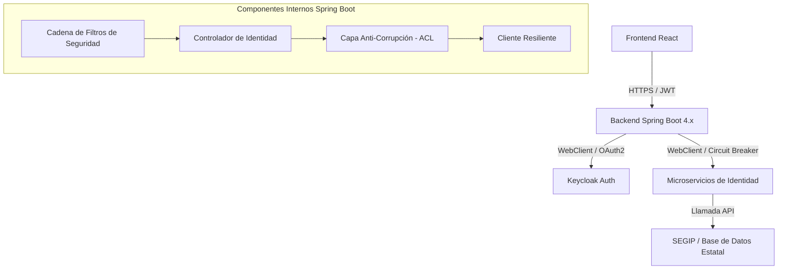

# Estrategia de Arquitectura Backend: Gateway Interno y ACL

## Diagrama de Arquitectura (Mermaid)

## Componentes de la Estrategia

### 1. Gateway de API Interno
El backend de Spring Boot actúa como punto único de entrada para el frontend, consolidando las llamadas a múltiples microservicios (Auth, Identidad, Validación). Maneja la propagación de autenticación (Token Relay).

### 2. Capa Anti-Corrupción (ACL)
Integra los modelos de API externos en los modelos de dominio internos del banco. Esto evita que los cambios en la API externa rompan toda la lógica de negocio del frontend/backend.

### 3. Capa de Resiliencia
Utiliza Resilience4j para gestionar timeouts y reintentos para la integración con SEGIP, asegurando que el sistema permanezca estable incluso ante fallos del proveedor externo.

### 4. Capa de Observabilidad
Integra Micrometer y OpenTelemetry para una visibilidad total del ciclo de vida del onboarding.
