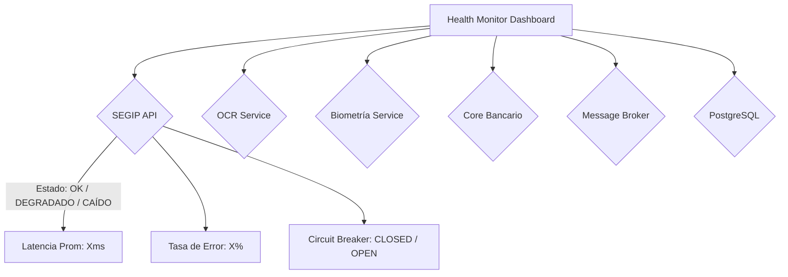
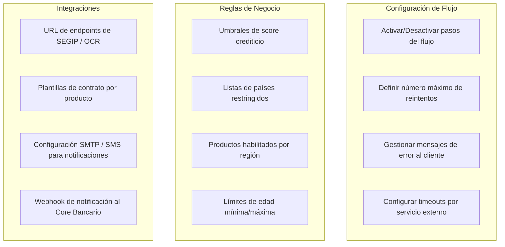
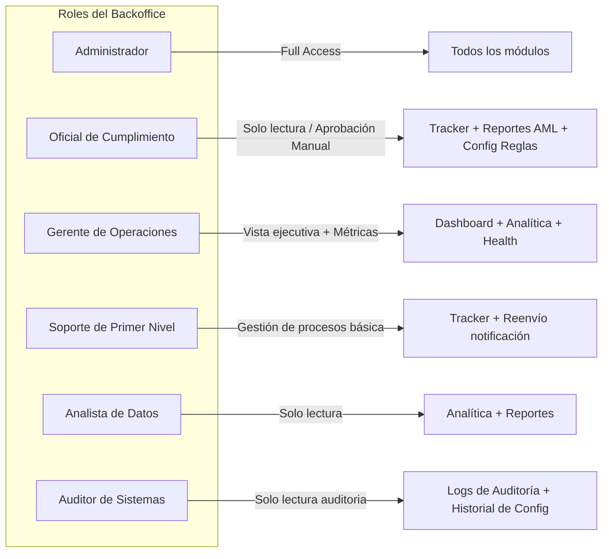
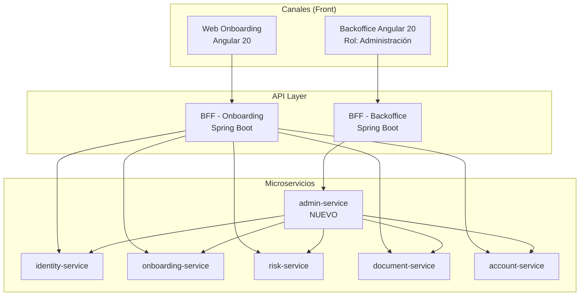
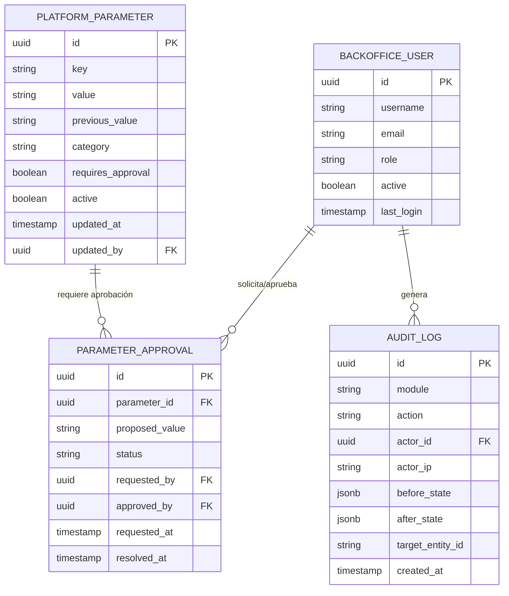

# Especificación: Backoffice de Onboarding Digital

> [!TIP]
> El Backoffice no es un CRUD de datos, es el **centro de control operativo** del banco para gestionar, monitorizar y optimizar cada aspecto del proceso de apertura de cuentas.

---

## 1. Módulos Funcionales Propuestos

### 1.1 Dashboard Ejecutivo (Home)
Visión en tiempo real del estado operativo de la plataforma.

| Widget | Descripción |
| :--- | :--- |
| **Onboardings Activos** | Contador en vivo de procesos en curso, por paso. |
| **Tasa de Conversión** | % de procesos iniciados vs completados (embudo). |
| **Tiempo Medio por Paso** | Identifica cuellos de botella (ej. lentitud en biometría). |
| **Alertas Críticas** | Servicios externos degradados (SEGIP, OCR, Core Bancario). |
| **Últimas Cuentas Abiertas** | Feed en tiempo real de aperturas exitosas. |

---

### 1.2 Módulo de Gestión de Procesos (Onboarding Tracker)
Control operacional de cada proceso individual, similar a un CRM.

**Funcionalidades:**
- **Búsqueda avanzada**: por CI, nombre, email, estado, rango de fechas, agente.
- **Vista detalle del proceso**: Línea de tiempo paso a paso con timestamps, resultado de cada validación y errores.
- **Acciones manuales** (con trazabilidad de auditoría):
  - Retroceder un paso ante error del sistema.
  - Aprobar manualmente un paso (ej. si SEGIP no responde y el oficial verifica por otro medio).
  - Cancelar un proceso con motivo documentado.
  - Reenviar notificación al cliente.
- **Vista de Auditoría**: Todos los cambios de estado con `actor`, `timestamp` y `motivo`.

---

### 1.3 Módulo de Monitorización de Servicios (Health Monitor)
Panel de salud de todos los servicios del ecosistema.



**Indicadores por servicio externo:**
- Estado: `OPERATIONAL` / `DEGRADED` / `DOWN`
- Latencia promedio (últimos 5 min / 1h / 24h)
- Tasa de error (%)
- Estado del Circuit Breaker (CLOSED / OPEN / HALF-OPEN)
- Historial de incidentes del día

---

### 1.4 Módulo de Analítica y Reportes
Inteligencia de negocio para la gerencia bancaria.

| Reporte | Periodicidad | Descripción |
| :--- | :--- | :--- |
| **Embudo de Conversión** | Diario / Semanal | % de abandono por step |
| **Causas de Rechazo** | Diario | Top de razones: AML, biometría, documentos |
| **Análisis de Tiempo** | Semanal | Tiempo promedio total de onboarding por canal |
| **Rendimiento SLA** | Mensual | % de procesos completados en < X minutos |
| **Cobertura Geográfica** | Mensual | Mapa de calor de apertura de cuentas por región |
| **Comparativa de Canales** | Mensual | Web vs Mobile App |

**Exportación**: PDF, Excel, CSV, integración con BI corporativo vía API.

---

### 1.5 Módulo de Parametrización (Configuration Center)
Permite al banco ajustar el comportamiento del sistema sin necesidad de despliegues.



> [!IMPORTANT]
> Todos los cambios de parametrización deben crear un registro de auditoría con el usuario, la IP, el valor anterior y el valor nuevo. Ningún parámetro crítico puede modificarse sin un flujo de aprobación (4-eyes principle).

---

### 1.6 Módulo de Gestión de Usuarios y Roles (RBAC)
Control de acceso granular para el personal del banco.



---

### 1.7 Módulo de Notificaciones y Alertas Operacionales
Sistema de alertas proactivas para el equipo de operaciones.

**Canales de alerta:**
- Correo electrónico
- Slack / Microsoft Teams (Webhook)
- Notificación en el propio Backoffice (badge en campana)

**Reglas de alerta configurable:**
- Circuit Breaker abierto por más de X minutos.
- Tasa de abandono sube más de un 20% respecto a la hora anterior.
- Proceso de onboarding pendiente de revisión manual por más de 4 horas.
- Error de comunicación con el Core Bancario.

---

### 1.8 Módulo de Auditoría y Compliance
Cumplimiento normativo con trazabilidad total.

| Log Auditado | Datos Registrados |
| :--- | :--- |
| **Accesos al Backoffice** | Usuario, IP, timestamp, ruta visitada |
| **Acciones sobre procesos** | Aprobación manual, cancelación, motivo, actor |
| **Cambios de configuración** | Parámetro, valor anterior, valor nuevo, usuario, 4-eyes approval |
| **Exportación de datos** | Quién, qué reporte, rango de fecha, IP |
| **Intentos fallidos de login** | Usuario, IP, timestamp, número de intentos |

---

## 2. Arquitectura Técnica del Backoffice

### 2.1 Posición en el Ecosistema



**Justificación de BFF separado para Backoffice**: El BFF del Backoffice (`BFF-BO`) tiene requerimientos de seguridad y datos distintos al BFF del cliente. Requiere scopes administrativos y acceso a datos sensibles que nunca deben estar disponibles en el canal público. La separación previene filtraciones accidentales.

### 2.2 El `admin-service` (Nuevo Microservicio)

```text
com.sif.admin
├── domain
│   ├── model
│   │   ├── AdminAction.java           # Acción administrativa con auditoría
│   │   └── PlatformParameter.java     # Parámetro configurable del sistema
│   └── port
│       ├── in
│       │   ├── GetDashboardMetricsUseCase.java
│       │   ├── SearchOnboardingProcessesUseCase.java
│       │   └── UpdatePlatformParameterUseCase.java
│       └── out
│           ├── MetricsRepository.java
│           └── AuditLogRepository.java
├── application
│   └── service
│       ├── DashboardService.java     # Agrega métricas de todos los MS
│       └── ParameterService.java     # Gestión de config con 4-eyes
└── infrastructure
    ├── in.rest
    │   └── AdminController.java
    └── out
        ├── persistence
        └── external
            └── PrometheusMetricsAdapter.java  # Lee de Prometheus/Actuator
```

### 2.3 Modelo de Datos del Backoffice



---

## 3. UX del Backoffice (Angular 20)

### 3.1 Estructura de la aplicación

```text
backoffice-app/
├── core
│   ├── auth            # Keycloak con roles ADMIN_* scope
│   └── guards          # Guards por módulo y por acción
├── features
│   ├── dashboard        # Home con widgets en tiempo real
│   ├── tracker          # Búsqueda y gestión de procesos
│   ├── health-monitor   # Estado de servicios externos
│   ├── analytics        # Reportes con gráficos (Recharts/NgCharts)
│   ├── config-center    # Parámetros y reglas de negocio
│   ├── user-management  # Gestión de usuarios del backoffice
│   ├── audit-log        # Trazabilidad de acciones
│   └── notifications    # Centro de alertas operacionales
└── shared
    ├── ui               # Tablas, Filtros, Cards de métricas
    └── charts           # Componentes de visualización
```

### 3.2 Señales de Tiempo Real (WebSocket / SSE)
El dashboard y el health monitor se actualizan en tiempo real mediante **Server-Sent Events (SSE)** desde el `admin-service`:

```typescript
// dashboard.service.ts
export class DashboardService {
  private readonly metricsStream$ = fromEvent<MetricUpdate>(
    new EventSource('/api/admin/metrics/stream'),
    'message'
  );

  readonly activeOnboardings = toSignal(
    this.metricsStream$.pipe(
      filter(e => e.type === 'ACTIVE_COUNT'),
      map(e => e.value)
    ),
    { initialValue: 0 }
  );
}
```

**Justificación de SSE sobre WebSocket**: SSE es unidireccional (servidor → cliente), lo que es suficiente para un dashboard de métricas y tiene menor overhead que WebSockets, siendo además compatible con HTTP/2 multiplexing sin configuración especial.
