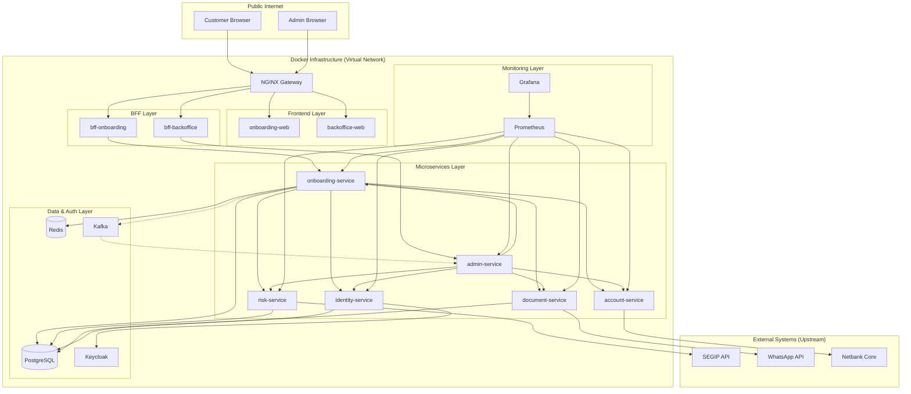

# Especificación de Infraestructura Docker — Onboarding Digital SSB

Este documento detalla la arquitectura de contenedores, interconexiones y estimación de recursos para el ecosistema de Onboarding Digital.

---

## 1. Stack Tecnológico de Contenedores

La infraestructura se divide en 6 capas lógicas, todas orquestadas mediante Docker (Docker Compose para ambientes locales/dev y Kubernetes/Helm para producción).

### 1.1 Capa de Entrada (Edge/Gateway)
| Contenedor | Imagen Base | Función |
| :--- | :--- | :--- |
| `api-gateway` | `nginx:alpine` | Proxy inverso, terminación SSL, Load Balancing y ruteo a BFFs. |

### 1.2 Capa de Frontend (Web Apps)
| Contenedor | Imagen Base | Función |
| :--- | :--- | :--- |
| `onboarding-web` | `nginx:alpine` | Aplicación Angular 20 para clientes finales (estáticos). |
| `backoffice-web` | `nginx:alpine` | Aplicación Angular 20 para administración (estáticos). |

### 1.3 Capa de Aplicación (Backend Microservices)
| Contenedor | Imagen Base | Framework |
| :--- | :--- | :--- |
| `bff-onboarding` | `openjdk:17-slim` | Spring Boot 4.x (Backend for Frontend Clientes). |
| `bff-backoffice` | `openjdk:17-slim` | Spring Boot 4.x (Backend for Frontend Admin). |
| `identity-service` | `openjdk:17-slim` | Gestión de identidades y sesiones. |
| `onboarding-ms` | `openjdk:17-slim` | Orquestador del flujo de 8 pasos. |
| `risk-service` | `openjdk:17-slim` | Integración con listas AML/PEP/ASFI. |
| `document-service` | `openjdk:17-slim` | Gestión de documentos, firmas y OCR. |
| `account-service` | `openjdk:17-slim` | Integración con el Core Bancario. |
| `admin-service` | `openjdk:17-slim` | Logs de auditoría y métricas de plataforma. |

### 1.4 Capa de Persistencia y Cache
| Contenedor | Imagen Base | Función |
| :--- | :--- | :--- |
| `ssb-db` | `postgres:15-alpine` | Base de datos relacional principal. |
| `ssb-cache` | `redis:7-alpine` | Cache de estado de flujo y sesiones cortas. |

### 1.5 Capa de Mensajería (Event-Driven)
| Contenedor | Imagen Base | Función |
| :--- | :--- | :--- |
| `kafka` | `confluentinc/cp-kafka` | Broker de eventos para auditoría y sincronización. |
| `zookeeper` | `confluentinc/cp-zookeeper` | Orquestador de Kafka. |

### 1.6 Capa de Identidad y Observabilidad
| Contenedor | Imagen Base | Función |
| :--- | :--- | :--- |
| `keycloak` | `quay.io/keycloak/keycloak` | Servidor IAM (OAuth2/OIDC). |
| `prometheus` | `prom/prometheus` | Recolección de métricas. |
| `grafana` | `grafana/grafana` | Visualización de dashboards. |

## 1. Justificación Técnica Expandida

La arquitectura propuesta responde a los requisitos críticos de **seguridad, auditabilidad y alta disponibilidad** exigidos por la normativa ASFI y el modelo de negocio de SSB.

### 1.1 Arquitectura de Microservicios y BFF
Se optó por el patrón **BFF (Backend for Frontend)** para desacoplar la lógica de presentación de la lógica de negocio. Esto permite:
- **Seguridad**: El `bff-backoffice` implementa controles de acceso administrativo que nunca se exponen al cliente final.
- **Rendimiento**: Agregación de datos optimizada para vistas específicas (Dashboard vs. Formulario de Cliente).
- **Escalabilidad**: El flujo de cliente (BFF Onboarding) puede escalar independientemente de las tareas administrativas.

### 1.2 Persistencia Dual (SQL + NoSQL)
- **PostgreSQL**: Garantiza integridad referencial y soporte para transacciones ACID en el registro definitivo de cuentas y auditoría.
- **Redis**: Utilizado para la **gestión de estado de flujo**. Permite que un cliente continúe su proceso en caso de desconexión sin perder datos capturados, con latencias de <1ms.

### 1.3 Mensajería y Auditoría (Kafka)
El uso de Kafka permite un registro de eventos **inmutable**. Cada acción (OTP validado, OCR procesado, firma generada) se publica en un bus de eventos, permitiendo:
- **Trazabilidad total**: Reconstruir cronológicamente cualquier proceso de onboarding para auditorías de la ASFI.
- **Microservicio de Auditoría (Admin Service)**: Consume estos eventos de forma asíncrona para generar alertas y reportes sin afectar la velocidad del flujo de onboarding.

### 1.4 Resiliencia (Circuit Breaker)
Dada la dependencia de sistemas externos (SEGIP, Core Bancario), se implementa **Resilience4j**. Si SEGIP está fuera de línea, el sistema activa el modo "Degradado" o deriva el flujo a oficina física de forma automática, evitando timeouts infinitos en el frontend.

---

## 2. Glosario de Términos

### Términos Técnicos
- **BFF (Backend for Frontend)**: Patrón de diseño donde se crea un servidor backend específico para cada tipo de interfaz (Web, Mobile, Admin).
- **Circuit Breaker**: Patrón de resiliencia que "corta" la conexión a un servicio fallido para evitar fallos en cascada.
- **OCR (Optical Character Recognition)**: Tecnología para extraer texto de imágenes, en este caso, de las fotos del carnet de identidad.
- **SSE (Server-Sent Events)**: Tecnología de comunicación unidireccional servidor-cliente para actualizaciones en tiempo real (utilizada en el Dashboard).
- **IAM (Identity and Access Management)**: Marco de políticas y tecnologías para asegurar que los usuarios correctos tengan el acceso adecuado.
- **RBAC (Role-Based Access Control)**: Método de restringir el acceso al sistema a usuarios autorizados basándose en sus roles.
- **ACID**: Propiedades de las transacciones de base de datos (Atomicidad, Consistencia, Aislamiento y Durabilidad).

### Términos de Negocio / Bancarios
- **ASFI**: Autoridad de Supervisión del Sistema Financiero de Bolivia.
- **SEGIP**: Servicio General de Identificación Personal.
- **AML (Anti-Money Laundering)**: Prevención de lavado de activos.
- **PEP (Politically Exposed Person)**: Personas que desempeñan funciones públicas destacadas y requieren mayor escrutinio.
- **One-Shot Signature**: Firma digital válida para un único documento o transacción específica.
- **Core Bancario**: Sistema central que gestiona las operaciones financieras del banco (ej. Netbank).
- **Matching Facial**: Comparación biométrica entre dos imágenes (Selfie vs. Foto de CI) para validar identidad.
- **4-Eyes Principle**: Requisito de que una acción sea aprobada por una segunda persona antes de ejecutarse (usado en parametrización).

---

## 3. Stack Tecnológico de Contenedores

## 3. Detalle Técnico de Imágenes y Servicios

| Servicio | Imagen / Versión | Funcionalidad | Tareas en la Arquitectura |
| :--- | :--- | :--- | :--- |
| **API Gateway** | `nginx:1.25-alpine` | Proxy inverso y seguridad perimetral. | Terminación SSL, Rate Limiting, CORS, Redirección a BFFs. |
| **Onboarding Web** | `nginx:1.25-alpine` | Frontend de cliente (Angular 20). | Servir contenidos estáticos, manejo de rutas SPA, assets. |
| **Backoffice Web** | `nginx:1.25-alpine` | Frontend administrativo (Angular 20). | Interfaz de gestión operativa y dashboards ejecutivos. |
| **BFF Onboarding** | `openjdk:17-slim` | Orquestador de cara al cliente. | Unificación de APIs, gestión de sesiones de flujo, seguridad. |
| **BFF Backoffice**| `openjdk:17-slim` | Orquestador de cara a admin. | Agregación de métricas, gestión de reportes, seguridad RBAC. |
| **Onboarding MS** | `openjdk:17-slim` | Lógica de negocio del flujo. | Control de estados (1 a 8), validación de transiciones. |
| **Identity MS** | `openjdk:17-slim` | Motor de validación de identidad. | Ejecución de OCR, Matching Facial, consulta SEGIP. |
| **Risk MS** | `openjdk:17-slim` | Motor de cumplimiento. | Cruce contra listas PEP, AML, ASFI y Retenciones. |
| **Document MS** | `openjdk:17-slim` | Gestión documental y firmas. | Generación de contratos PDF, Firma One-Shot, envío WhatsApp. |
| **Account MS** | `openjdk:17-slim` | Integración Core Bancario. | Alta de cliente y cuenta en Netbank, mapeo de datos core. |
| **Admin MS** | `openjdk:17-slim` | Centro de control y auditoría. | Consumo de logs de Kafka, auditoría sistémica, health checks. |
| **Keycloak** | `keycloak:23.0` | Servidor IAM (OAuth2/OIDC). | Autenticación, autorización RBAC, gestión de tokens JWT. |
| **PostgreSQL** | `postgres:15-alpine` | Base de datos principal. | Persistencia ACID de clientes, cuentas y auditoría. |
| **Redis** | `redis:7-alpine` | Cache de alta velocidad. | Almacenamiento de estado temporal del flujo (`flow_state`). |
| **Kafka** | `cp-kafka:7.5` | Bus de eventos inmuntables. | Registro de pasos completados para auditoría y analítica. |

---

## 4. Cálculo de Estimación de Recursos

La estimación se basa en un perfil de carga transaccional y el footprint técnico de cada stack tecnológico.

### 4.1 Variables del Cálculo
- **Throughput Mensual**: 5,000 onboardings.
- **Pico de Concurrencia**: 50 usuarios simultáneos (Concurrent Users).
- **Footprint Spring Boot**: ~400MB (Base) + 256MB (Heap/Metaspace) + ~150MB (OS/Overhead) ≈ **800MB por instancia**.
- **Footprint NGINX/Web**: ~64MB (Base) + ~64MB (Cache/Buffers) ≈ **128MB por instancia**.
- **Footprint PostgreSQL**: `shared_buffers` + (`work_mem` * `max_connections`) ≈ **2GB base**.

### 4.2 Lógica de Asignación (Producción HA)

| Nivel | Cálculo | Resultado RAM | CPU Sugerido |
| :--- | :--- | :--- | :--- |
| **Frontends** | 2 Apps x 2 Réplicas x 256MB | 1 GB | 1.0 Core |
| **BFFs** | 2 Apps x 2 Réplicas x 1GB | 4 GB | 2.0 Cores |
| **Microservicios** | 6 Apps x 2 Réplicas x 1GB | 12 GB | 12.0 Cores |
| **IAM (Keycloak)** | 2 Réplicas x 2GB | 4 GB | 2.0 Cores |
| **Persistencia (DB)** | 1 Master + 1 Slave (Failsaver) | 8 GB | 4.0 Cores |
| **Mensajería (Kafka)** | 3 Nodos Cluster x 2GB | 6 GB | 3.0 Cores |
| **Cache (Redis)** | 2 Nodos x 512MB | 1 GB | 1.0 Core |
| **TOTAL** | — | **36 GB** | **25 Cores** |

### 4.3 Lógica de Asignación (Ambiente de Desarrollo - Dev)
*Objetivo: Funcionalidad completa en un solo nodo. Sin alta disponibilidad.*

| Nivel | Cálculo | Resultado RAM | CPU Sugerido |
| :--- | :--- | :--- | :--- |
| **Edge / Frontends** | 1 Gateway + 2 Web Apps | 512 MB | 0.5 Core |
| **BFFs** | 2 Apps x 800MB | 1.6 GB | 1.0 Core |
| **Microservicios** | 6 Apps x 800MB | 4.8 GB | 3.0 Cores |
| **IAM (Keycloak)** | 1 Instancia | 1 GB | 1.0 Core |
| **Persistencia (DB)** | 1 Instancia (Standalone) | 2 GB | 1.0 Core |
| **Mensajería (Kafka)** | 1 Nodo (KRaft / Bitnami) | 2 GB | 1.0 Core |
| **Cache (Redis)** | 1 Instancia | 256 MB | 0.2 Core |
| **TOTAL** | — | **10.2 GB** | **7.7 Cores** |

### 4.4 Lógica de Asignación (Ambiente de Pruebas y QA)
*Objetivo: Paridad técnica con producción para pruebas funcionales y de carga moderada.*

| Nivel | Cálculo | Resultado RAM | CPU Sugerido |
| :--- | :--- | :--- | :--- |
| **Edge / Frontends** | 2 Réplicas x 256MB | 512 MB | 0.5 Core |
| **BFFs** | 2 Apps x 1 GB | 2 GB | 1.0 Core |
| **Microservicios** | 6 Apps x 1 GB | 6 GB | 6.0 Cores |
| **IAM (Keycloak)** | 2 Réplicas (HA Test) | 2 GB | 1.0 Core |
| **Persistencia (DB)** | 1 Master + 1 Slave | 4 GB | 2.0 Cores |
| **Mensajería (Kafka)** | 2 Nodos (Mínimo HA) | 4 GB | 2.0 Cores |
| **Cache (Redis)** | 1 Instancia Sentinel | 512 MB | 0.5 Core |
| **TOTAL** | — | **19 GB** | **13 Cores** |

### 4.5 Cálculo de Almacenamiento (Proyectado a 1 año)
- **Producción**: **~350 GB (NVMe SSD)**.
- **Pruebas / QA**: **~100 GB (SSD)**. (Datos de prueba rotativos).
- **Desarrollo**: **~40 GB (SSD)**. (Persistencia mínima).

---

## 5. Redes y Volúmenes (Docker Compose Strategy)

### 4.1 Redes (Networks)
- `frontend-net`: Solo Gateway y Web Apps.
- `backend-net`: Gateway, BFFs y Microservicios.
- `data-net`: Microservicios, DB, Redis, Kafka e IAM. *Sin acceso desde el Gateway.*
- `monitoring-net`: Prometheus y todos los exportadores de métricas.

### 4.2 Volúmenes (Volumes)
- `db_data`: `/var/lib/postgresql/data` (Persistente).
- `iam_data`: `/opt/keycloak/data` (Persistente).
- `kafka_data`: `/var/lib/kafka/data` (Persistente).
- `doc_storage`: `/app/storage` (NFS o Volumen compartido para documentos temporales).

---

## 5. Consideraciones de Seguridad en Docker

1. **Non-Root Users**: Todos los microservicios deben correr bajo un usuario `spring` o `app`, nunca como `root`.
2. **Secrets Management**: Uso de `docker secrets` o variables de entorno enmascaradas (ej. HashiCorp Vault).
3. **Resource Limits**: Configurar explicitamente `deploy.resources.limits` en el Compose para evitar "Noisy Neighbors".
4. **Image Scanning**: Uso de Trivy o Snyk para escanear vulnerabilidades en las imágenes base `alpine` o `slim`.
5. **Private Registry**: Todas las imágenes deben residir en un registro privado (Azure ACR, AWS ECR o Harbor).
